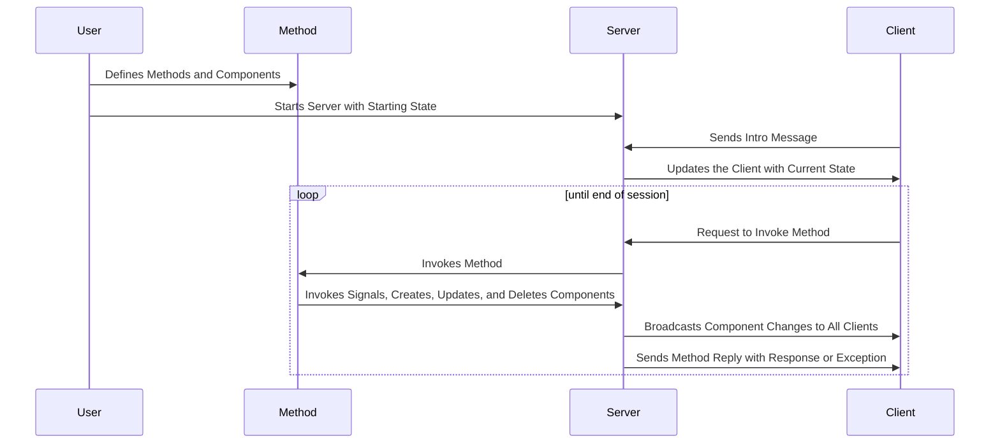

# Rigatoni


Python Server Library for NOODLES Protocol

## Description
This server library implements the NOODLES messaging protocol and provides objects for maintaining a scene in state. 
The server uses a websocket connection to send CBOR encoded messages. To customize its implementation, the library 
provides convenient interface methods to assist the user in writing their own methods for the server. The user can
also add custom delegates to add additional functionality to any of the standard components.

## How does the server work?
The server handles incoming websocket connections and maintains a list of clients that are currently connected. 
After a client has sent an introductory message, they are free to invoke methods defined by the server. The server 
parses each message and attempts to invoke a corresponding method which has been injected by the user. The server 
calls this method and sends a reply with either a response or an exception. 



## Getting Started
### 1. Install the server library

```pip install rigatoni```

### 2. Define components to be held in the server's starting state
- Use starting component objects to help here
```python
rigatoni.StartingComponent(Type[Component], dict[Component_Attr, Value])
```
- You can refer to the objects listed in `noodle_objects.py` to find all the available delegates along with their 
mandatory, default, and optional attributes. Additional information on NOODLE components and their attributes can 
be found [here](https://github.com/InsightCenterNoodles/message_spec)
- When creating methods, an additional callable object should be attached. This method will be injected onto the 
- server, and it will be associated with its corresponding method component.

```python
rigatoni.StartingComponent(Type[Component], dict[Component_Attr, Value], Callable)
```

### 3. Define custom delegates

The server comes with a default delegate class for each component that is maintained in the server's state. These
default delegates can be subclassed to add more functionality to each component in the scene. For example, the table 
delegate doesn't store any data by default, but users can customize it using any data structure they like. Below is a
simple example where the table delegate uses an added dataframe. A more complete version of this example can be found in
tests/servers.py.

```python
import pandas as pd
from rigatoni import Table

class CustomTableDelegate(Table):

    dataframe = pd.DataFrame()

    def handle_delete(self, keys: list[int]):
        self.dataframe.drop(index=keys, inplace=True)
        return keys
```

Now your methods, can use these custom classes and their new associated functions.

### 4. Start running the server

```python
server = Server(50000, starting_state, delegates)
server.run()  # will run until server.shutdown() is called
```
or alternatively, you can use a context manager to automatically start running the server in a new thread

```python
with Server(50000, starting_state, delegates) as server:
    # do stuff
```

## More Info on Creating Methods
The majority of the user's time building a server application will be spent defining methods. To help the user with 
this process, this library provides several interface methods to reduce friction when interacting with state and the 
server object. Also it is important to note that each method is injected and called so that the first two arguments 
are a reference to the server object and the method invoke's context as a dict.

### Interface Methods

```python
server.create_component(comp_type: Type[Component], ** kwargs)
server.delete_component(obj: Component | Delegate | ID])
server.update_component(obj: Component, delta: Set[str)
server.invoke_signal(signal: ID, on_component: Component, signal_data: list[Any])
server.get_ids_by_type(component: Type[Component])
server.get_delegate_id(name: str)
server.get_delegate(identifier: ID | str | context)
server.get_delegate_by_context(context: context)
```
As an alternative to the generic `create_component()` method, there are more specific implementations for each 
delegate type. These offer more explicit arguments and type hinting.

### Geometry Library
Creating a renderable entity is an involved process that makes use of several different components. To help simplify this process the library provides methods to create all the linked components necessary for a mesh.

```python
rigatoni.geometry.GeometryPatchInput(
    vertices: list
    indices: list
    index_type: str 
    material: MaterialID
    normals: Optional[list] 
    tangents: Optional[list]
    textures:Optional[list] 
    colors: Optional[list]
)
rigatoni.geometry.build_geometry_patch(server: Server, name: str, input: GeometryPatchInput)

instances = rigatoni.geometry.create_instances(
    positions: Optional[list[nooobs.Vec3]], 
    colors: Optional[list[nooobs.Vec4]], 
    rotations: Optional[list[nooobs.Vec4]], 
    scales: Optional[list[nooobs.Vec3]]
)
rigatoni.geometry.build_entity(server: Server, geometry: Geometry, instances: Optional[Mat4])

rigatoni.geometry.update_entity(server: Server, entity: Entity, geometry: Optional[Geometry], instances: Optional[Mat4])
rigatoni.geometry.add_instances(server: Server, entity: Entity, instances: Mat4)
```


## Hungry for more NOODLES?
For more information and other related repositories check out [this repository](https://github.com/InsightCenterNoodles)
