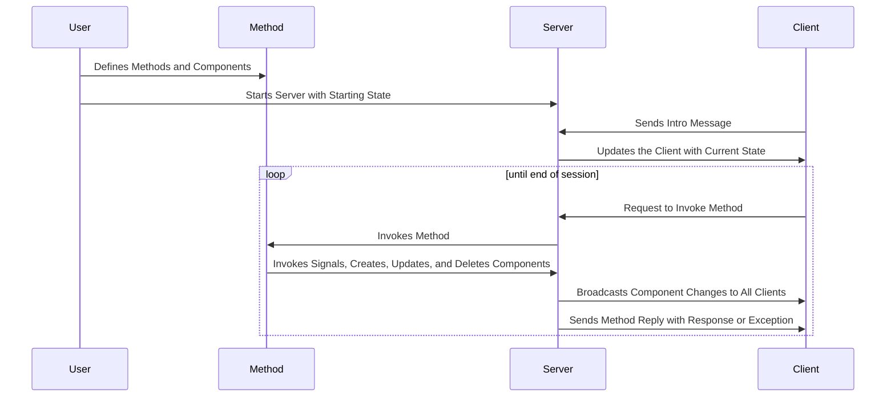

# Python Server

Python Server Library for NOODLES Protocol

## Description
This server library implements the NOODLES messaging protocol and provides objects for maintaining a scene in state. The server uses a websocket connection to send CBOR encoded messages. To customize its implementation, the library provides convenient interface methods to assist the user in writing their own methods for the server. The user can also add custom delegates to add additionaly functionality to any of the standard components.

## How does the server work?
The server handles incoming websocket connections and maintains a list of clients that are currently connected. After a client has sent an introductory message, they are free to invoke methods disclosed by the server. The server parses each message and attempts to invoke a corresponding message which has been injected by the user. The server calls this method and sends a reply with either a response or an exception. 



## Getting Started
### 1. Install the server library

```pip install rigatoni```

### 2. Define components to be held in the server's starting state
- Use starting component objects to help with the creation of these components
```python
rigatoni.StartingComponent(Type[Component], dict[Component_Attr, Value])
```
- You can refer to the objects listed in `noodle_objects.py` to find all the available components along with their mandatory, default, and optional attributes. Additional information on NOODLE components and their attributes can be found [here](https://github.com/InsightCenterNoodles/message_spec)
- Note that components must be initialized with keyword arguments to allow for validation
- When creating methods, an additional callable object should be attached. This method will be injected onto the server object, and it will be associated with its corresponding method component.

```python
rigatoni.StartingComponent(Type[Component], dict[Component_Attr, Value], Callable)
```

### 3. Start running the server

```python
asyncio.run(rigatoni.start_server(port: [int], starting_state: list[StartingComponent]))
```

## More Info on Creating Methods
The majority of the user's time building a server application will be spent defining methods. To help the user with this process, this library provides several interface methods to reduce friction when interacting with state and the server object. Also it is important to note that each method is injected and called so that the first two arguments are a reference to the server object and the method invoke's context as a dict.

### Interface Methods
```python
server.create_component(comp_type: Type[Component], **kwargs)
server.delete_component(obj: Union[Component, Delegate, ID])
server.update_component(obj: Component, delta: Set[str)
server.invoke_signal(signal: ID, on_component: Component, signal_data: list[Any])
server.get_ids_by_type(component: Type[Component])
server.get_component_id(type: Type[Component], name: str)
server.get_component(id: ID)
```

### Geometry Library
Creating a renderable entity is an involved process that makes use of several different components. To help simplify this process the library provides methods to create all the linked components necessary for a mesh.

```python
rigatoni.geometry.GeometryPatchInput(
    vertices: list
    indices: list
    index_type: str 
    material: MaterialID
    normals: Optional[list] 
    tangents: Optional[list]
    textures:Optional[list] 
    colors: Optional[list]
)
rigatoni.geometry.build_geometry_patch(server: Server, name: str, input: GeometryPatchInput)

instances = rigatoni.geometry.create_instances(
    positions: Optional[list[nooobs.Vec3]], 
    colors: Optional[list[nooobs.Vec4]], 
    rotations: Optional[list[nooobs.Vec4]], 
    scales: Optional[list[nooobs.Vec3]]
)
rigatoni.geometry.build_entity(server: Server, geometry: Geometry, instances: Optional[Mat4])

rigatoni.geometry.update_entity(server: Server, entity: Entity, geometry: Optional[Geometry], instances: Optional[Mat4])
rigatoni.geometry.add_instances(server: Server, entity: Entity, instances: Mat4)
```


## Hungry for more NOODLES?
For more information and other related repositories check out [this repository](https://github.com/InsightCenterNoodles)
