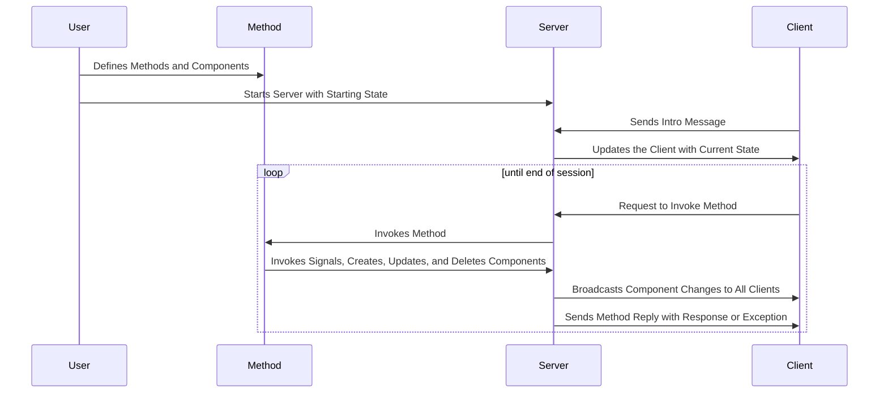

# Overview

Rigatoni is the first library to implement the NOODLES messaging protocol in Python. The NOOODLES protocol
allows multiple client applications to interact collaboratively with data in real-time. The protocol is especially 
geared towards applications that can render 3D meshes and other data.
This server library provides objects and methods for maintaining a noodles session in state.
The server uses a websocket connection to send CBOR encoded messages. To customize its implementation, the library 
provides convenient interface methods to assist the user in writing their own methods for the server. The user can
also add custom delegates to add additional functionality to any of the standard components.

## Why use Rigatoni?

Rigatoni is a great choice for anyone who wants to use the NOODLES protocol while working in Python. With a server
application to host data and custom methods, users will be able to interact with data from any client application that
implements the NOODLES protocol. Rigatoni offers a simple interface for creating methods and components, and it provides
additional support for working with meshes and complex geometry. If you are looking to use NOODLES with a different
language, there is currently support for C++, Rust, Julia, and Javascript 
[here](https://github.com/InsightCenterNoodles/).

## How does the server work?

The server handles incoming websocket connections and maintains a list of clients that are currently connected. 
After a client has sent an introductory message, they are free to invoke methods defined by the server. The server 
parses each message and attempts to invoke a corresponding method which has been injected by the user. The server 
calls this method and sends a reply with either a response or an exception.
